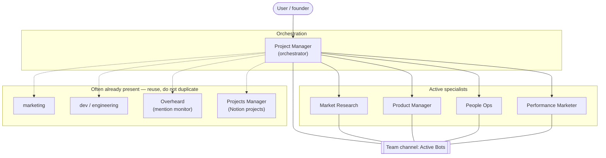

# Organization chart

## Reporting model

| Role | Reports to | Job (one line) |
| --- | --- | --- |
| **Project Manager** | User | Turn goals into briefs; assign specialists; synthesize status |
| **Market Research** | Project Manager | Competitive intel, audience, trends → sourced briefs |
| **Product Manager** | Project Manager | Problems, roadmap, specs, shipping decisions |
| **People Ops** | Project Manager | Hiring loops, role defs, onboarding, light team ops |
| **Performance Marketer** | Project Manager | Paid/measurable growth, experiments, conversion reporting |

Optional peers (coordinate via Project Manager; do not recreate if they already exist):

| Role | Job (one line) |
| --- | --- |
| marketing | Brand / campaigns / positioning |
| dev | Engineering, PRs, shipping code |
| Overheard | Third-party mentions of brand/name/URLs |
| Projects Manager | Notion row-per-project + specialist task claim |

## Handoffs

| From | Hands off to | When |
| --- | --- | --- |
| Market Research | Performance Marketer / marketing | Insights ready for campaigns |
| Market Research | Product Manager | Opportunities that need product decisions |
| Product Manager | dev | Specs ready to build |
| People Ops | Project Manager | Pipeline status / hiring blockers |
| Performance Marketer | Market Research | Need deeper audience or competitor data |
| Any specialist | Project Manager | Blocked, needs tools/access, or done with a report |
