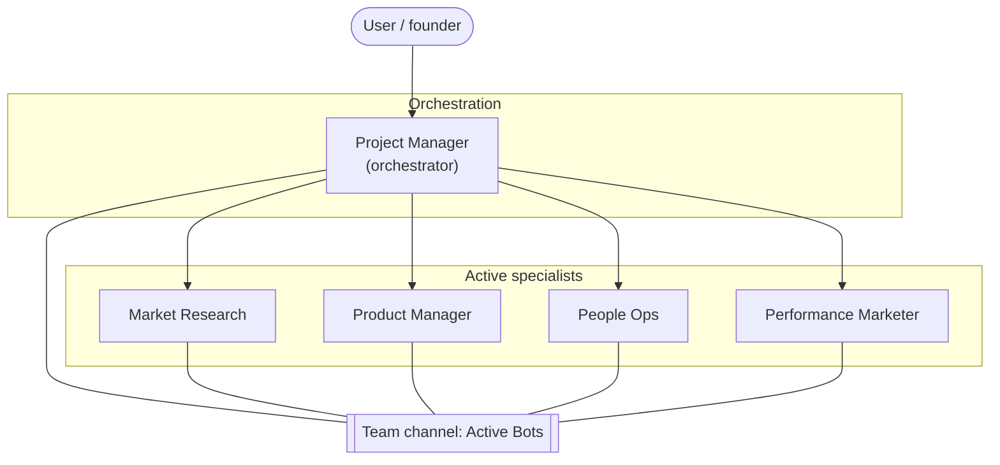

# Organization chart — Company OS

Livestream Company OS pattern only: orchestrator + four specialists + team channel.

## Reporting model

| Role | Reports to | Job (one line) |
| --- | --- | --- |
| **Project Manager** | User | Turn goals into briefs; assign specialists; synthesize status |
| **Market Research** | Project Manager | Competitive intel, audience, trends → sourced briefs |
| **Product Manager** | Project Manager | Problems, roadmap, specs, shipping decisions |
| **People Ops** | Project Manager | Hiring loops, role defs, onboarding, light team ops |
| **Performance Marketer** | Project Manager | Paid/measurable growth, experiments, conversion reporting |

## Handoffs

| From | Hands off to | When |
| --- | --- | --- |
| Market Research | Performance Marketer | Insights ready for campaigns |
| Market Research | Product Manager | Opportunities that need product decisions |
| Product Manager | Project Manager | Specs ready to build — orchestrator routes shipping |
| People Ops | Project Manager | Pipeline status / hiring blockers |
| Performance Marketer | Market Research | Need deeper audience or competitor data |
| Any specialist | Project Manager | Blocked, needs tools/access, or done with a report |

Machine-readable source of truth: [`chart.json`](./chart.json).
