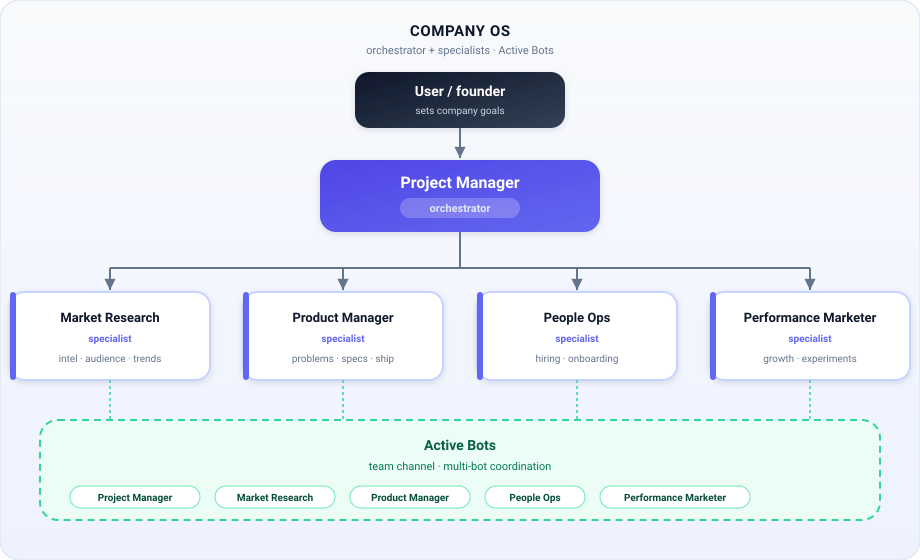
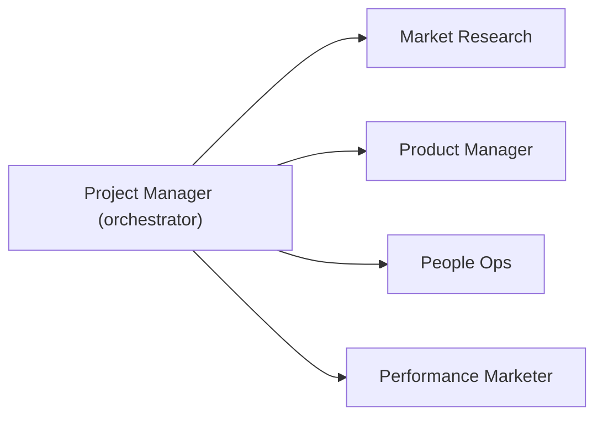

# Company OS

Portable **company operating system** matching the livestream Company OS pattern: one orchestrator (**Project Manager**), four narrowly scoped specialists, and an **Active Bots** team channel for multi-bot coordination.

> **Agents:** follow [`../../PROTOCOL.md`](../../PROTOCOL.md) and use this folder’s [`chart.json`](./chart.json) — do not invent roles from this prose beyond what’s in `chart.json`.

```
                              ┌─ Market Research — competitive intel, audience, trends
                              ├─ Product Manager — roadmap, specs, shipping decisions
Project Manager ──────────────┼─ People Ops — hiring, roles, onboarding
briefs · assigns · unblocks   └─ Performance Marketer — paid growth, experiments, conversion
```

---

## 1. What Company OS is

Company OS is an org pattern popularized in livestreams about running a company with agents: treat each agent like a **job description** (one lane), put an **orchestrator** in front to intake goals and assign work, and keep specialists focused so chats don’t turn into a single overloaded assistant.

This chart package is **platform-agnostic**. It describes *who* should exist and *how* they hand off — not which product’s CLI to call. Your agent reads `chart.json` and uses **your** platform’s spawn / create-agent / channel tools.

**In this chart:** Project Manager (orchestrator) + Market Research + Product Manager + People Ops + Performance Marketer, seated together in **Active Bots**. No optional peer roles.

---

## 2. Org chart

Orchestrator + four specialists + Active Bots only — no optional peers.



<details>
<summary>Mermaid source (optional)</summary>



</details>

| Role | Kind | Reports to | Job (one line) |
| --- | --- | --- | --- |
| **Project Manager** | Orchestrator | User | Turn goals into briefs; assign specialists; synthesize status |
| **Market Research** | Specialist | Project Manager | Competitive intel, audience, trends → sourced briefs |
| **Product Manager** | Specialist | Project Manager | Problems, roadmap, specs, shipping decisions |
| **People Ops** | Specialist | Project Manager | Hiring loops, role defs, onboarding, light team ops |
| **Performance Marketer** | Specialist | Project Manager | Paid/measurable growth, experiments, conversion reporting |

---

## 3. Design principles

1. **Scope like a JD** — one agent, one lane; clear in-scope / out-of-scope so work doesn’t collapse onto one chat.
2. **Trust after tools** — hand tools, access, and context; then let specialists run. Improve with feedback instead of micromanaging every step.
3. **Vault for secrets** — never paste API keys, tokens, or credentials into chat; use the platform’s vault / secure secret flows.
4. **Reuse templates** — prefer focused bots and reusable briefs over bloating a single thread.
5. **Reuse matching agents** — if a teammate already matches a role name/job, reuse and update profile; don’t duplicate.

---

## 4. Roles in depth

### Project Manager (orchestrator)

**Kind:** orchestrator · **Reports to:** the user · **Not** Product Manager — this role coordinates the company OS; it does not own the product roadmap.

**Why they exist**  
Someone has to turn vague goals into assignable work, keep specialists in lane, track parallel streams, and give the user a single coherent status. Without an orchestrator, every specialist either waits forever or invents conflicting priorities.

**Day-to-day responsibilities**  
- Intake goals from the user; clarify success criteria before assigning.  
- Write briefs for specialists: goal, context, success criteria, what to report back, and what *not* to do.  
- Assign the right specialist (Market Research vs Product Manager vs People Ops vs Performance Marketer).  
- Track parallel work; unblock with tools, access, or missing context.  
- Synthesize specialist outputs into status updates the user can act on.  
- Keep lanes clean — push deep work back to specialists rather than doing it yourself.  
- Use **Active Bots** for multi-bot coordination when a thread needs more than one specialist.  
- Prefer the current agent as Project Manager when the spawn policy says so, unless the user wants a separate orchestrator.

**What good output looks like**  
- Clear briefs with measurable success criteria.  
- Status that names owners, blockers, and next decisions — not a dump of every chat.  
- Specialists unblocked; no duplicate jobs; secrets never in chat.

**In scope**  
Goal intake and prioritization; briefing; routing; cross-team status; unblocking; seating Active Bots; enforcing lane discipline.

**Out of scope**  
Deep primary research dumps; writing full product specs end-to-end; running paid campaigns; owning hiring pipelines; inventing metrics; pasting secrets.

**Hands off to**  
Every specialist for deep work; receives reports and blockers back from all four.

---

### Market Research (specialist)

**Kind:** specialist · **Reports to:** Project Manager

**Why they exist**  
Growth and product decisions need grounded intel: competitors, audience, sizing, trends. Market Research produces **sourced** briefs so Performance Marketer and Product Manager don’t invent the market.

**Day-to-day responsibilities**  
- Competitive landscape scans and positioning notes.  
- Audience / segment insights and jobs-to-be-done style research.  
- Market sizing and trend spotting — cite sources or mark estimates explicitly.  
- Structured briefs with takeaways, opportunities, and risks.  
- Hand campaign-ready insight to Performance Marketer; product opportunities to Product Manager.  
- Escalate blockers (tools, access, ambiguous brief) to Project Manager.

**What good output looks like**  
- Briefs with citations or clearly labeled estimates — never invented metrics.  
- Explicit “so what” and recommended next owners.  
- Clean handoffs: campaign-ready vs product-decision-ready.

**In scope**  
Competitive and market research; audience and trends; sizing (cited or estimated); opportunity/risk flags; sourced briefs; research requests from Performance Marketer.

**Out of scope**  
Final go-to-market campaigns; writing ads; product specs/PRDs; hiring; legal advice; inventing numbers without labeling estimates.

**Hands off to**  
Performance Marketer (campaign insights); Product Manager (product opportunities); Project Manager (done / blocked).

---

### Product Manager (specialist)

**Kind:** specialist · **Reports to:** Project Manager · **Not** the orchestrator — this role owns product clarity and shipping decisions aligned to user value.

**Why they exist**  
Someone must sharpen the problem, prioritize the roadmap, write specs/PRDs and acceptance criteria, and make tradeoffs so build work is ready to route — without owning ads, hiring, or deep market surveys.

**Day-to-day responsibilities**  
- Problem statements, user stories, and acceptance criteria.  
- Roadmap prioritization and tradeoff memos.  
- Specs / PRDs that are build-ready.  
- Shipping decisions aligned to user value; track what’s shipping vs blocked.  
- Hand build-ready work **back to Project Manager** to route to whoever ships on this platform.  
- Pull product-relevant insights from Market Research when needed (via PM or direct handoff patterns in the chart).

**What good output looks like**  
- Specs a builder can execute without guessing.  
- Explicit tradeoffs and success criteria.  
- Clear “ready to build” packages returned to Project Manager.

**In scope**  
Problem clarity; roadmap priority; specs/PRDs; acceptance criteria; tradeoffs; shipping status; build-ready handoffs to Project Manager.

**Out of scope**  
Ads and brand campaigns; paid acquisition; deep market surveys (use Market Research); recruiting/hiring (People Ops); acting as company-wide orchestrator.

**Hands off to**  
Project Manager (build-ready specs, blockers, done reports).

---

### People Ops (specialist)

**Kind:** specialist · **Reports to:** Project Manager

**Why they exist**  
Scaling without chaos needs hiring pipelines, role definitions, interview loops/scorecards, and light onboarding/team ops — without pretending to be legal counsel or owning product/marketing.

**Day-to-day responsibilities**  
- Job descriptions and role definitions.  
- Interview loops, scorecards, and onboarding checklists.  
- Candidate pipeline hygiene and hiring process design.  
- Lightweight people/process ops (calendars, rituals, ops docs — not HR legal).  
- Report pipeline status and hiring blockers to Project Manager.

**What good output looks like**  
- JDs and scorecards that specialists and the user can reuse.  
- Clear pipeline status (stages, owners, blockers).  
- Careful handling of candidate-sensitive information; no secrets in chat.

**In scope**  
Hiring pipelines; JDs; interview loops/scorecards; onboarding; light team ops; pipeline hygiene; process design for people ops.

**Out of scope**  
Legal advice; employment law rulings; product roadmap; market research dumps; paid acquisition; inventing compensation policy as gospel.

**Hands off to**  
Project Manager (pipeline status, blockers, done reports).

---

### Performance Marketer (specialist)

**Kind:** specialist · **Reports to:** Project Manager

**Why they exist**  
Paid and measurable growth needs an owner: funnels, creative tests, channel experiments, and conversion reporting — coordinating back to Market Research when deeper intel is needed.

**Day-to-day responsibilities**  
- Paid/growth campaign plans and experiment designs.  
- Funnel and landing-page messaging tests; channel mix experiments.  
- Creative tests with clear hypotheses and success metrics.  
- Attribution-minded conversion reporting (no invented ROAS).  
- Request deeper audience/competitor research from Market Research when data is thin.  
- Prefer real account connectors over guessing; vault for all credentials.

**What good output looks like**  
- Experiment writeups: hypothesis, setup, result, next step.  
- Metrics tied to sources or platform data — never fabricated.  
- Clear asks back to Market Research or Project Manager when blocked.

**In scope**  
Paid/measurable growth; funnels; creative tests; channel experiments; conversion reporting; experiment writeups; coordination with Market Research for deeper intel.

**Out of scope**  
Pure competitor research dumps (Market Research); product specs (Product Manager); hiring (People Ops); inventing performance numbers; pasting ad-account secrets into chat.

**Hands off to**  
Market Research (need deeper data); Project Manager (done / blocked / results).

---

## 5. Handoff table

| From | Hands off to | When |
| --- | --- | --- |
| Market Research | Performance Marketer | Insights ready for campaigns |
| Market Research | Product Manager | Opportunities that need product decisions |
| Market Research | Project Manager | Blocked, needs tools/access, or done with a report |
| Product Manager | Project Manager | Specs ready to build — orchestrator routes shipping; or blocked/done |
| People Ops | Project Manager | Pipeline status / hiring blockers; or blocked/done |
| Performance Marketer | Market Research | Need deeper audience or competitor data |
| Performance Marketer | Project Manager | Blocked, needs tools/access, or done with a report |
| Project Manager | Any specialist | Assigning briefs for deep work |

Machine-readable handoffs live in [`chart.json`](./chart.json).

---

## 6. Team channel: Active Bots

**Who sits there:** Project Manager, Market Research, Product Manager, People Ops, Performance Marketer.

**How coordination works**  
- Default: Project Manager briefs specialists in 1:1 (or platform equivalent) and synthesizes for the user.  
- Use **Active Bots** when a goal needs multi-bot discussion (e.g. research → product tradeoff → campaign angle in one thread).  
- Do **not** fan out a kickoff that wakes every member until the user gives a first company goal (`spawn.do_not_fanout_until_first_goal`).  
- If the platform caps channel membership, prioritize the orchestrator + as many required specialists as fit, and tell the user who was left out.

---

## 7. How to import

Tell your agent to follow [`../../PROTOCOL.md`](../../PROTOCOL.md) with chart id **`company-os`**.

Examples:

- “Import **company-os** from this repo.”
- “Follow PROTOCOL.md and spawn Company OS.”
- “Load `charts/company-os/chart.json` and stand up the team on my platform.”

---

## 8. Agents callout

**Spawn from [`chart.json`](./chart.json) only.** This README is human context. Do not invent roles, optional peers, or scope from this prose beyond what’s defined in `chart.json`. Use your platform’s spawn CLI — do not assume Grok Bot / Cursor tool names.
